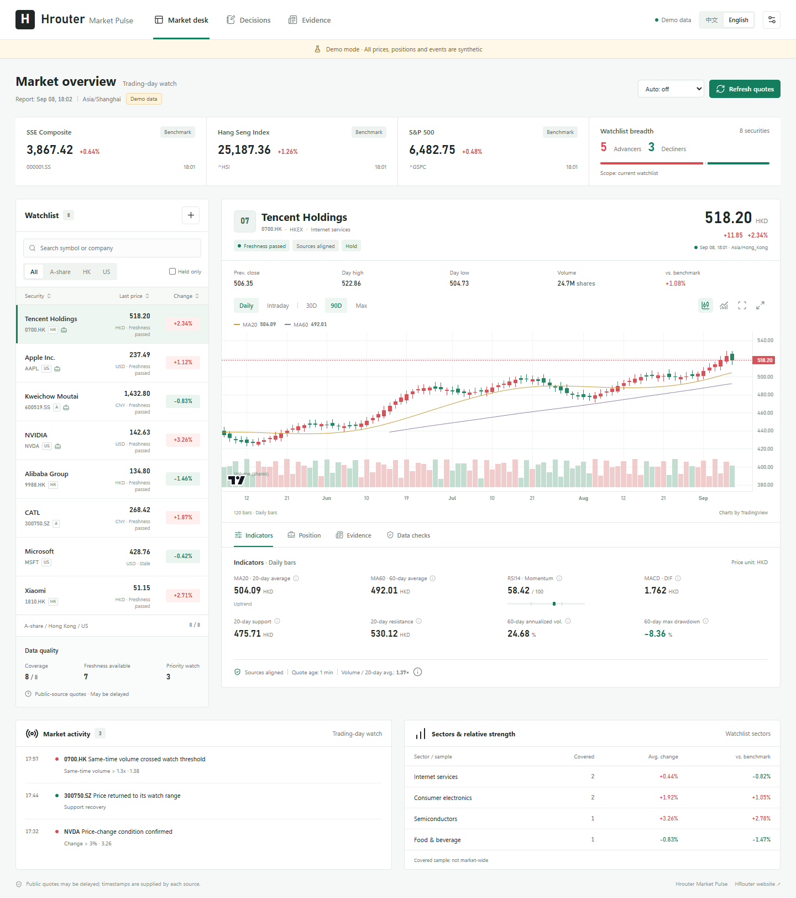

# Hrouter Market Pulse

**An open-source research workbench for mainland China, Hong Kong, and US equities, packaged as a Codex plugin.**

[简体中文](README.md) · [Website](https://hrouter.net/) · [Usage](docs/USAGE.md) · [Methodology](docs/METHODOLOGY.md)



Bring quotes, holdings, alerts, filings, and decision records into one workspace. Deterministic tools handle calculations and timestamps; the model in the current Codex task handles research and interpretation. No separate model service is required.

## Features

- Persistent Chinese / English interface, searchable and sortable watchlists, holdings filters, daily and five-minute charts, volume and explicit indicator periods.
- Cross-source quote checks with session-aware freshness, historical sample requirements, and stateful alert transitions.
- Benchmark comparisons, watchlist sector groups, clearly scoped breadth, original-source evidence and announced event dates.
- Currency-aware position budgets with dated FX inputs, existing holdings, shared cash and aggregate risk constraints.
- Shared-capital backtests with holding restrictions, costs, adverse slippage, nonfills and company-action handling.
- Purged walk-forward prediction evaluation, baseline comparisons, programmatic qualification, and an immutable forecast ledger.
- Decision theses recorded before outcomes, followed by append-only reviews.

## Install in Codex

Requires Node.js 20+ and a Codex release with plugin support.

```bash
codex plugin marketplace add honestTai/hrouter-market-pulse
codex plugin add hrouter-market-pulse@hrouter-market-pulse
```

Start a new task after installation. Select Hrouter Market Pulse and ask:

```text
Use English. Add AAPL, MSFT, and 0700.HK to my watchlist and create an intraday report.
```

The installable package includes its server bundle and browser assets. A release ZIP can also be extracted and registered using `codex plugin marketplace add <extracted-directory>`.

## Run locally

```bash
git clone https://github.com/honestTai/hrouter-market-pulse.git
cd hrouter-market-pulse
npm ci
npm run build
npm run demo
```

Open [http://127.0.0.1:8787](http://127.0.0.1:8787). Demo data is synthetic; changes stay in memory. Use `npm start` for the real-data dashboard, configure a watchlist, and refresh. Validate with `npm test`, `npm run check`, and `npm run smoke`.

## Coverage and limitations

Public quote providers can delay, throttle, or reject requests. This project provides no broker-real-time feed or order execution. Official adapters cover SEC submissions / financial facts and CNINFO announcements. HKEXnews currently uses original-record import. Full-market breadth requires a sourced universe-level input; watchlist breadth is never labeled as the entire market.

Data failures remain visible. Technical models are experimental and do not establish a future return. Read the [methodology](docs/METHODOLOGY.md) for calendar coverage, execution assumptions, and qualification gates. Watchlists, holdings, evidence, and journals stay in a local storage directory outside the repository; queried symbols are sent to the selected public providers.

## Contributing

See [CONTRIBUTING.md](CONTRIBUTING.md). Include timestamps, source identifiers, expected behavior, and a sanitized reproduction. Do not include credentials or brokerage account data.

MIT-licensed project code. TradingView Lightweight Charts and Lucide retain their respective licenses and attributions in [THIRD_PARTY_NOTICES.md](THIRD_PARTY_NOTICES.md).

Official website: [hrouter.net](https://hrouter.net/).
