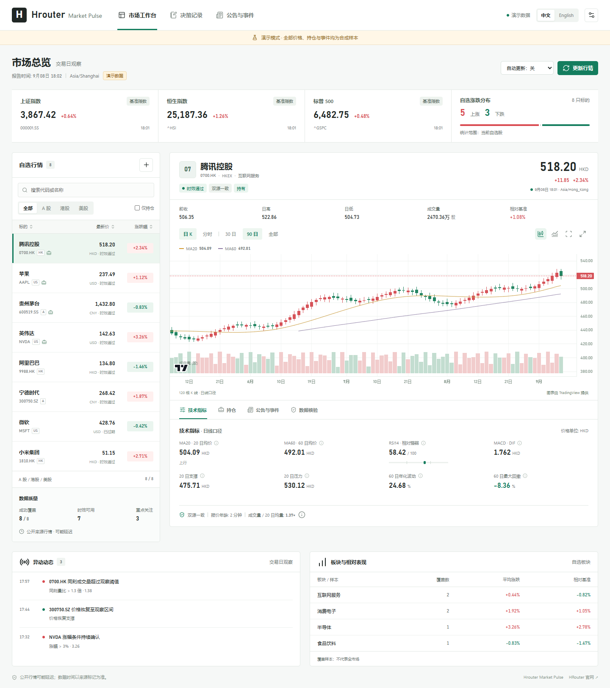

<div align="center">

[English](README.md) · **简体中文**

[HRouter](https://hrouter.net/home) · [All public projects](https://github.com/honestTai) · [Star & Fork trends](#project-activity)

</div>

[](#project-activity)

<div align="center">

# HRouter Market Pulse

**把行情、公告与研究记录，放到同一个工作台。**  
**Your quotes, filings, and research notes—in one workspace.**

[中文](README.zh-CN.md) · [English](README.md) · [下载插件 / Plugin releases](https://github.com/honestTai/hrouter-market-pulse/releases) · [GitHub](https://github.com/honestTai/hrouter-market-pulse) · [HRouter](https://hrouter.net/home)

</div>

不只看一张涨跌表：在中英文工作台里查看持仓、核对行情、跟踪异动和公告，并保留判断与复盘记录。

Go beyond a price table: review holdings, cross-check quotes, follow alerts and filings, and keep a record of your reasoning.

**适合谁 / Who it’s for**  
希望结合可复核数据与 AI 整理 A 股、港股和美股研究的用户。  
Researchers who want verifiable data and AI-assisted workflows for mainland China, Hong Kong, and US equities.

插件使用当前 Codex 任务模型，无需另配模型服务。



## 能做什么

| 工作流 | 能力 |
| --- | --- |
| 看盘 | 中英文切换、自选股筛选排序、持仓优先、日线和 5 分钟图、成交量、清晰的指标周期与数据状态 |
| 行情核验 | Yahoo Finance 与腾讯财经交叉检查，核对报价时间、交易时段、历史样本和数据质量 |
| 异动监控 | 记录触发、恢复和冷却状态，避免同一个条件反复通知；过期数据不触发新交易信号 |
| 研究背景 | 指数对照、相对强弱、自选池行业分组，明确区分自选池统计和完整市场统计 |
| 公告证据 | SEC 公告与财务事实、巨潮公告适配器，以及原始交易所公告导入；保留来源和首次可见时间 |
| 风险预算 | 校验币种与汇率，纳入已有持仓、可用现金、组合风险和交易单位 |
| 策略验证 | 按时间推进的共享资金回测、市场持有规则、费用滑点、公司行动，以及滚动样本外评估 |
| 决策复盘 | 保存原始判断和当时证据，追加结果回顾；预测先记录，结果后核对 |

## 安装 Codex 插件（可自动更新）

需要 Node.js 20 或更新版本，以及支持插件的 Codex CLI / 桌面应用。

自动更新安装器从 **v1.2.0** 起提供；更早的 ZIP 不包含安装器。

**推荐：**从 [Releases](https://github.com/honestTai/hrouter-market-pulse/releases/latest) 下载最新正式版 ZIP，解压后在目录内运行：

```bash
node scripts/install.mjs --auto-update
```

这会安装插件，并明确启用**当前用户的自动更新任务**：约每 6 小时检查正式版本，校验后在插件进程退出时安装，保留设置和上一版。不会修改系统 PATH 或安装全局依赖。只想手动更新时省略 `--auto-update`。安装或更新后，新建 Codex 任务，再选择 HRouter Market Pulse。

已按旧方式安装的用户，需要先关闭旧插件任务，再执行一次 `node scripts/install.mjs --auto-update --migrate`。[完整更新说明、停用与回退](docs/AUTO_UPDATE.md)。

```text
设置中文界面，自选股为 600519、0700.HK、AAPL，生成盘中报告。
```

也可以使用普通 GitHub marketplace 安装；**以下方式不注册本项目的自动更新器**：

```bash
codex plugin marketplace add honestTai/hrouter-market-pulse
codex plugin add hrouter-market-pulse@hrouter-market-pulse
```

安装包已包含 MCP 运行文件和图表资源。ZIP 的解压根目录才是 marketplace，不要把 `plugins/hrouter-market-pulse` 当作 marketplace 根目录。

## 本地运行与开发

```bash
git clone https://github.com/honestTai/hrouter-market-pulse.git
cd hrouter-market-pulse
npm ci
npm run build
npm run demo
```

浏览器打开 [http://127.0.0.1:8787](http://127.0.0.1:8787)。演示模式使用明确标注的合成数据，修改仅保存在本次进程内。

运行 `npm start` 启动真实数据工作台，在设置中添加自选股后刷新。运行 `npm test`、`npm run check` 和 `npm run smoke` 验证源码、构建及 MCP 接口。

## 数据边界

- 公开行情可能延迟或被限流。本项目没有券商级实时数据承诺，也不连接下单接口。
- HKEXnews 公告当前通过原始记录导入。完整市场广度需要带来源与统计范围的数据输入，自选池涨跌数始终标注为自选池。
- 官方源不可用时显示失败或缺失，不用模拟行情替代。财务数据保留单位、期间与修订信息，不自动混算不同期间。
- 内置交易日历的覆盖范围、回测执行假设和模型准入条件见[方法说明](docs/METHODOLOGY.md)。历史样本和模拟成交不能证明未来收益。
- 自选股、持仓、证据与决策记录写入本机数据目录，不写入仓库。报告的联网查询会把所查证券代码发送给对应数据源。

## 项目结构

```text
mcp/                       服务、行情、风控、研究与 HTTP 接口
assets/                    看盘界面与本地第三方图表资源
skills/                    7 个 Codex 工作流技能
tests/                     离线回归测试
docs/                      使用、方法、宣传与截图
plugins/hrouter-market-pulse/  自动构建的可安装插件
.agents/plugins/marketplace.json  Codex marketplace 入口
```

代码采用 [MIT](LICENSE) 许可证。图表使用 [TradingView Lightweight Charts](https://www.tradingview.com/lightweight-charts/)，图标使用 [Lucide](https://lucide.dev/)，各自许可证见 [THIRD_PARTY_NOTICES.md](THIRD_PARTY_NOTICES.md)。

欢迎提交包含复现步骤、数据时间和脱敏样例的 Issue 或 PR。项目官网：[https://hrouter.net/](https://hrouter.net/)。

## 作者与 HRouter · About the author

我是 **honestTai**，开发工具，也运营 [HRouter](https://hrouter.net/home)。这里持续分享实用代码、AI 应用、Skills 与插件，把工作中的需求变成可复用的项目。  
I’m **honestTai**, the developer and operator behind HRouter. I share practical code, AI apps, skills, and plugins built around real workflows.

此工作流使用你在 Codex 环境中的模型。HRouter 是我同时运营的模型路由服务，面向 AI 编程与应用开发。  
This workflow uses the model in your Codex environment. HRouter is another part of my work: a model-routing service for AI coding and applications.

[了解 HRouter · Explore HRouter](https://hrouter.net/home) · [发现更多项目 · More projects](https://github.com/honestTai)

**觉得有用，欢迎 Star；有想法，欢迎到 Issues 交流。**  
**Star the project if it helps, and share your ideas in Issues.**

---

<a id="project-activity"></a>

## 项目动态 · Project activity

当前 Star / Fork 数量与留存事件历史，计划每日更新。

[](https://github.com/honestTai/honestTai/blob/main/data/README.md)

[每日实测趋势](https://raw.githubusercontent.com/honestTai/honestTai/main/assets/metrics/hrouter-market-pulse-daily.svg) · [数据口径](https://github.com/honestTai/honestTai/blob/main/data/METHODOLOGY.zh-CN.md) · [全部公开项目](https://github.com/honestTai)

<sub>历史曲线仅重建当前仍保留的 Star 与可见 Fork，并非过去每日净总量。每日实测总量自 2026-10-06 开始，不伪造回填。</sub>
