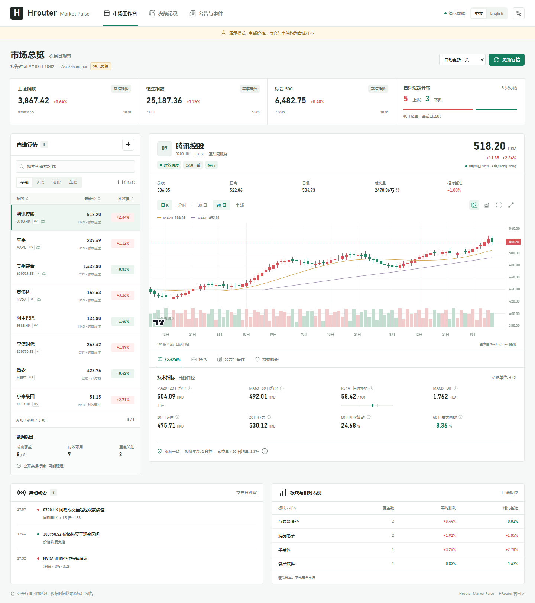

# Hrouter Market Pulse 开源：把看盘、证据和复盘放到同一个工作台

打开行情软件，我们很容易看到一只股票涨了多少。更难回答的是：这条行情是什么时间的，异动有没有新的依据，我的持仓是否已经承担了过多风险，以及昨天的判断今天还成不成立。

Hrouter Market Pulse 是围绕这些问题做的开源项目。它支持 A 股、港股和美股，提供中英文看盘界面，也可以作为 Codex 插件使用。

## 看得清，也能回头核对

工作台把自选行情、持仓、K 线、成交量、指标和数据状态放在一起。指标注明计算周期，报告时间与行情时间分别展示。公开数据过期、来源不一致或者历史样本不足时，界面会显示这些问题。

盘中提醒会记录状态变化。同一个价格条件持续成立时，不需要每隔几分钟重复打扰；真正值得关注的是新触发、确认或恢复。

## 研究需要留下依据

插件内置公告和财务数据适配器，也支持导入交易所原始记录。来源地址、发布时间和首次获取时间会留在证据库中。你可以写下入场条件、失效条件、持有周期与风险预算，再在盘后追加复盘记录。

技术计算由程序完成，研究解释由当前 Codex 任务模型完成，无需额外配置一个模型服务。回测考虑共享资金和市场约束，预测模型先做滚动样本外评估，再决定是否具备进入研究评审的条件。

## 从本地开始

项目提供可安装的 Codex 插件、独立工作台和不接触个人数据的演示模式。源码、构建脚本、测试和中英文文档一起公开，开发者可以扩展数据源和策略，也能直接检查每个数字是怎样计算出来的。

公开行情仍可能延迟，数据源覆盖也有边界。Hrouter Market Pulse 不连接下单接口，不承诺收益。它希望帮助使用者把判断过程记录得更完整，让依据和结果都能被检查。

**项目地址：** https://github.com/honestTai/hrouter-market-pulse

**官网：** https://hrouter.net/

欢迎带着具体的问题、数据时间和脱敏样例来提 Issue，也欢迎贡献新的数据适配器、回归测试和界面改进。
